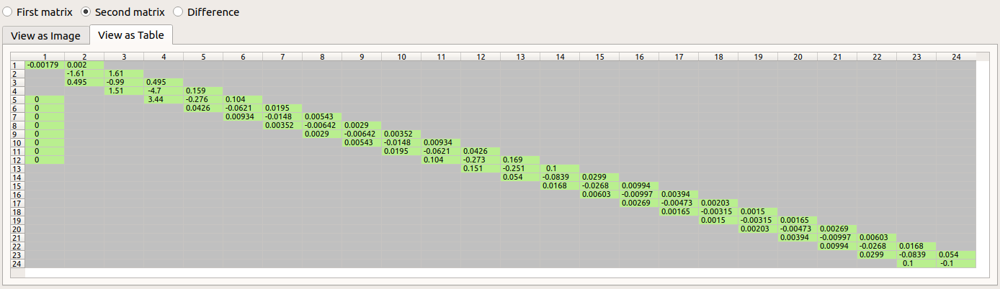

# JacobianMatrixViewer

Displays Jacobian matrix structure, exports images and allows comparison between Jacobian matrix patterns.

This is a small tool to assist in developing numerical solver engines, where Newton-Raphson methods
are used with custom Jacobians. Hereby, using an incomplete Jacobian pattern, or incorrectly computed
pattern will easily hamper efficiency of the Newton method. Sometimes this leads to increased number of
convergence failures, but often enough the effects are subtle, and it is hard to identify these as mistakes.
Especially, since a well-written Newton-equation solver within an adaptive time step integrator will
still yield correct results - yet potentially much slower.

## Installation

Grab the release and attached archives, extract, on Linux install Qt dependency, run.

You can always build from source, see below.

## Usage

Ok, enough boilerplate - what can you do with the tool?

Upon start, you select a matrix file to analyse. This can be a dense reference matrix (generated with accurate, yet slow finite-difference quotient algorithm),
or a sparse matrix. The tool supports plain ASCII table-like data files and custom binary formats
matching the CSR-data format used in the IBK and IBKMK libraries (see IBKMK::SparseMatrixCSR).

Then, you can see the structure of the matrix pattern and can compare values.

Use the radio-buttons to switch between different views.

For example, look at the dense reference matrix:

Green are cells with numbers different from zero and hence definitely part of the Jacobian pattern.
White are cells with zeros, which can either mean "not part of the Jacobian pattern", or computed to be zero. 
With many physical codes zeros can appear in the Jacobian matrix when clipping takes place, so make sure 
that is avoided when dumping the Jacobian data.

Now take a look at a sparse matrix:

Here, you see cells with dark-gray background. These are not part of the Jacobian pattern.

Finally, you can compare the two (radio-button "Difference"):

This is a bit more colorful:

- _orange_ : cells that are zero in one matrix and non-existend in the other; usually this means that these cells are not part of the Jacobian pattern
- _light blue_ : cells that have values in both matrixes and whose values differ only marginally (compared with relative tolerance of 1e-5 and absolute tolerance of 1e-9)
- _blue_ : cells that have values in both matrixes and show significant differences -> this usually indicates a *bug* in the Jacobian calculation/composition algorithm, or can be just a symptom of missing cells in the sparse Jacobian pattern, resuling in invalid coloring information. Hence, inside the DQ-algorithms columns are modified at the same time whose states are used by the same equations, thus resulting in invalid values being calculated.
- _red_ : cells that have values in one matrix, yet are not part of the Jacobian pattern in the other matrix. This clearly indicates that the sparse matrix is missing cells in its pattern.

The conclusions to be drawn from the example comparison table above are:
- the lower cells in column 1 are correctly present in the sparse matrix pattern, yet computed wrong (or not at all); this may indicate a bug in the coloring algorithm of the Jacobian composition algorithm that uses the matrix pattern
- the red cell (2,1) indicates that this cell is missing in the sparse matrix pattern
- the blue cell (2,3) shows an invalid value -> probably related to the cell (2,1) issue

## Binary matrix formats

Generally, the binary matrix file is composed as follows:

- `uint64_t` with size of matrix data block to follow = `matSize`
- `matSize` bytes with binary matrix storage data

The matrix storage block is different for different matrix types. Currently supported are Dense and Sparse-CSR-matrixes.

See example files `data/jacobian_dense.bin` and `data/jacobian_sparse.bin`.

### Sparse Matrix with CSR-storage

Sparse matrix patterns and values are stored in CSR format. Take a look at `IBKMK::SparseMatrixCSR::serialize()` to see the memory layout. It is basically:

- `char` (1 Byte) = 5  , indicates SparseMatrixCSR format
- `uint32_t` with counter `m_n`
- `uint32_t` with counter `m_nnz`
- binary vector with actual data of matrix (all non-zero elements)
- binary vector with ia index table (may not have zero length)
- binary vector with ja index table (may not have zero length)
- binary vector with iaT index table (only for assymmetric matrixes, may have length 0)
- binary vector with jaT index table (only for assymmetric matrixes, may have length 0)

### Dense Matrix storage

- `char` (1 Byte) = 1  , indicates Dense matrix format
- `uint32_t` with counter `m_n`
- binary vector with actual data of matrix (vector of doubles)
- binary vector with pivot elements (vector of long int)

### Binary vectors storage

Binary vectors are serialized by first writing the number of elements in the vector
as `uint32_t`, followed by the memory block with the actual content.

Look also at the serialization functions in `IBK_InputOutput.h`.

## Building from source

Two options: CMake and Qt

### CMake

Got to subdirectory `build/cmake`.

#### Windows

On Windows, simply run `build_VC_x64_with_pause.bat` (or `build_VC_x64.bat`, but the first will keep the console window open with potential error messages). Once the executable is built and copied to `bin/release_x64` go to this directory and run `deplay.bat`. This will pull and copy used DLLs into directory so that you can run the software from that directory.

You may need to edit `build_VC_x64_with_pause.bat` and/or `deploy.bat` to specify correct paths to the VC build environment and Qt installation.

#### Linux/Mac

Simply run `build.sh` in a terminal.

### Qt

Easiest thing is to open the session project file `build/Qt/JacobianMatrixViewer.pro` in Qt Creator and build it. This is also the recommended way to do further development.

